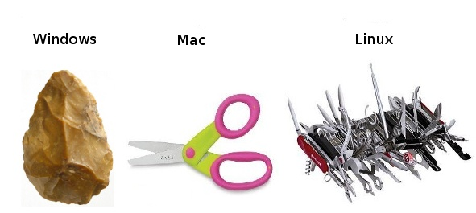
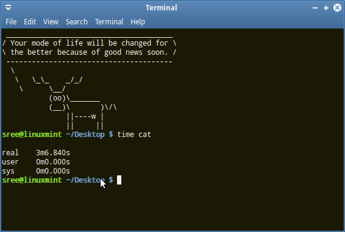
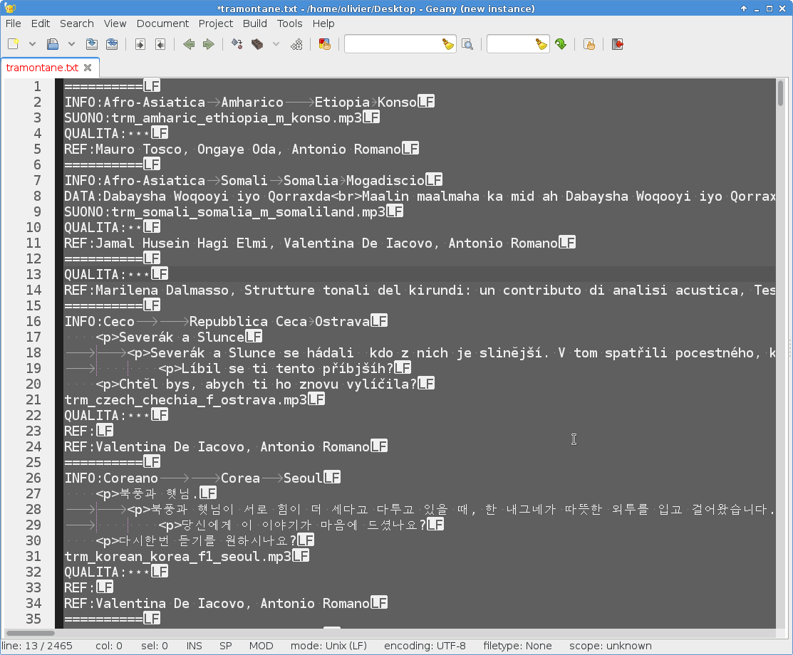
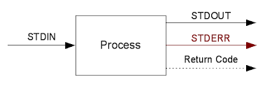

Big data wrangling, manipulation and homogenization
###################################################

.. rst2pdf file.rst -b1 -s slides2.style

.. footer::

        PhD Toolbox course - 2017-04-19

.. class:: center

Olivier Friard - Marco Gamba

.. class:: center

.. raw:: pdf

 PageBreak cutePage

Big data
========

large files
-----------

- Have you ever tried to load a matrix of 1000x1000 cells with Excel?

- great numbers of lines

great number of files
---------------------

- How to handle 1000s of files?

In this case the bash allows the use of iteration techniques

Command-line tools
==================

Various tools are available to access very large files or

`cat`_, `wc`_, `head`_, `tail`_, `nl`_, `sort`_, `uniq`_, `grep`_, `uniq`_, `awk_`, `sed`_

We will see how they work

Unix philosophy
===============

* Write programs that do one thing and do it well.
* Write programs to work together.
* Write programs to handle text streams, because that is a universal interface.

The command-line tools that we will use respect this philosophy
---------------------------------------------------------------

`en.wikipedia.org/wiki/Unix_philosophy <https://en.wikipedia.org/wiki/Unix_philosophy>`_

Linux
=====

Linux is a Unix-like computer operating system assembled under the model of free and open-source software development and distribution.

(macOS _ former Mac OS X and OS X _ is also a Unix-based graphical operating systems)

Linux has various distributions: Ubuntu, Debian, Fedora, Linux Mint...

Linux
=====

Linux will be used for practice during this part of the course.

You can also use macOS but some tools have some different behavior.

If you absolutely want to use Windows you can install the `Linux Bash Shell on Windows 10 <https://www.howtogeek.com/249966/how-to-install-and-use-the-linux-bash-shell-on-windows-10>`_

The shell
=========

A shell is a program that “interprets” your commands

Allows the user to execute commands by typing them manually in the terminal

**bash** (Bourne Again SHell) is a very common shell tht you will find on every Linux distribution (even macOS).

Terminal
=========

On Linux when you launch a terminal you will obtain a shell (usually bash)

You **can not** move the cursor with the mouse but you can select/copy/paste easily using the mouse buttons

All commands you typed are recorded (also after power off the computer), you can easily recall them by using the up/down arrow keys

Remember to use the TAB completion for the command-line tools and file names, be a **lazy user**!

The shell
=========

Command-line tools can be run by themselves, or you can provide additional
parameters. The typical command syntax is:

 ::

    date
    date -u
    date +%F

    date --date="12/2/2014"
    date -d "12/2/2014"

When you feel lost, and you have no idea on how to use a program,
remember that almost any program should have a ``-h`` or ``--help`` parameter:

 ::

    <command> --help

If no help is available, you can try to search for the command manual, by using **man**

 ::

    man <command>

Data
====

The bash tools are able to process data stored in text files or received on standard input.

A text file is **NOT** produced by Word or Writer !

A plain text file uses a characters set and contains no formatting or images.

Text encoding
=============

Encoding is a tedious but important argument.

Unicode (UTF-8) has replaced the old ASCII characters set in order to code all alphabets.

Important: Use a text editor that is capable to interpret Unicode encoding !

End-of-line
===========

Unfortunately the 3 main OS use different character as end-of-line:

- Windows: CR-LF
- macOS: CR
- Unix/Linux: LF

Important: Use a text editor that is capable to interpret all end-of-line characters!

Note that results files that come from remote servers (for example bioinformatic ones) are always with LF

File name
=========

Spaces
------

Spaces in file names present a problem when dealing with the bash

 ::

    cat results file 2017.txt
    cat "results file 2017.txt"

Avoid using them by replacing then by underscore ``_``

Case sensitivity
----------------

- Linux and macOS are case sensitive OS
- Windows is not case sensitive

So be careful when transfering file from Unixes to/from Windows

Text editors
=============

When your file is not so big you can use a text editor to check it.

There are a lot of good free/open-source text editors that will do the job:

- Linux: Geany, Sublimetext, Atom, Kate ...
- Windows: Geany, Notepad++, ...
- macOS: Geany, textedit ...

Text editor screenshot
=======================

In this example the editor visualize end-of-line character, tab and spaces and uses the UTF-8 encoding.

Anatomy of a command-line tool
==============================

Standard streams
-----------------

All about redirection
=====================

stdout
-------

By default the program output is directed to **stdout** (the terminal in our case)

We can **redirect** the stdout to a **file** with the **>** command

 ::

    ls -l > results.txt

Warning: the **results.txt** will be overwritten without asking you!

Instead of overwriting the file we can append the program output to it with the **>>** command

 ::

    ls -l >> results.txt

All about redirection
=====================

stderr
-------

By default the program errors are written to **stderr** (the terminal in our case)

We can **redirect**  the stderr to a file with the **2>** command

 ::

    find / -name "*" 2> results.txt

If we are not interested to the stderr data we can eliminate it:

 ::

    find / -name "*" 2> /dev/null

Warning: the **/dev/null** device is the Linux black hole

All about redirection
=====================

combination of redirections
----------------------------

redirection of stderr to stdout

 ::

    command 2>&1

redirection of stdout and stderr to a file

 ::

    command &> out_err.txt

input
=====

If you have multiple files to handle, you can use a wildcard in your file name.

 ::

    wc -l *.txt
    wc -l *.txt *.tsv
    wc -l x????.txt

Reproducible research
=====================

Important: Do not overwrite the results files but change the file names after every operation on your files

In this way you can go back in case of mistake

Example:

 ::

    sort file.txt > file_sorted.txt
    head -n 100 file_sorted.txt > file_sorted_truncated.txt

You can save all commands in a text file (**script**)

the **history** command can help you

pipes
=====

the pipe character ``|`` allow us to redirect the stdout to another program

 ::

    grep alice users.txt | wc -l

the above command will count the number of rows containing alice in the users.txt file

Using more CPU/Threads
======================

ls
==

LiSt
-----

list files

 ::

    ls
    ls -l
    ls -la
    ls -ltr
    ls -lh
    ls -lR

cat
===

``cat`` (CATenate) reads data from files, and outputs their contents.

 ::

    cat fruits.txt
    cat *.txt > one_big_file.txt
    cat -n fruits.txt

wc
==

``wc`` (Word Count) prints a count of lines, words, and bytes for each input file.

 ::

    wc fruits.txt

count the lines in all .txt files:

 ::

    wc -l *.txt

head
====

``head``, by default, prints the first 10 lines of each input file.

 ::

    head matrix.tsv

display only the first row:

 ::

    head -n 1 matrix.tsv

tail
====

``tail`` prints the last 10 lines of each input file

 ::

    tail results.txt

display continously the end of a file:

 ::

    tail -f results.txt

display rows from 100 to 105:

 ::

    head -n 105 results.txt | tail -n 5

assignement_display:

display the row #9099873 of the parking_violation_2014.csv file

nl
==

``nl`` numbers the lines in a file.

::

    nl list.txt > nlist.txt

::

    apples
    oranges
    potatoes
    lemons
    garlic

::

    1	apples
    2	oranges
    3	potatoes
    4	lemons
    5	garlic

sort
====

``sort`` sorts the contents of the input files, line by line

* -n   (or --numeric-sort)

* -k FIELD1,FIELD2

* -r   (or --reverse)

* -f   (or --ignore-case)

::

    sort

and now an easy assignment to begin...

assignement_sort: sort the various files (fruits.txt, numeric_values.txt and fruits_numeric.txt by 2nd column)

uniq
====

``uniq`` reports or filters out repeated lines in a file.

Important: the input must be sorted (use the **sort** command before applying uniq)

::

    cat fruits.txt | sort | uniq
    cat fruits.txt | sort | uniq -c
    cat fruits.txt | sort | uniq -d

grep
====

``grep`` prints any lines which match a specified pattern

::

    grep PATTERN FILE

Example:

 ::

    grep banana fruits.txt

Options:

-i   ignore case
-n   display line number
-c   count occurences
-v   list rows that do NOT contain the pattern
-r   recurse all sub directories
-w   will search for whole word
-l   will only display the file name

::

    grep '^banana' fruits.txt
    grep 'banana$' fruits.txt

grep assignement
================

shopping list
--------------

Go to the ``data/assignement_grep`` directory

Create a file containing the shopping list: ingredients present in ``recipe.txt`` file that are not in ``in_house.txt`` file

.. sort recipes.txt in_house.txt | uniq -d | grep -v -f - recipes.txt

sed
===

``sed`` is a Stream EDitor. It is used to perform basic text transformations

Replace every occurence of **text** by **example**

 ::

    sed 's#test#example#g' myfile.txt > newfile.txt

Delete the line #12 into the input file

 ::

    sed -i '12d' fruits.txt

Delete all rows containing apples

 ::

    sed -i '/apples/d fruits.txt

Important: the -i option make transformations irreversible!

sed assignement
===============

Go to the ``data/assignement_homogeneity`` directory

check the homogeneity of animal names in the ``list.txt`` file and replace animal names when mistyped

.. head list.txt
   awk -F'_' '{print $1}' list.txt | sort | uniq
   sed -i 's#XXX#YYY#g' list.txt

for
===

this command allows you to loop over elements. The syntax is:

 ::

    for VARIABLE in LIST; DO command $VARIABLE; done

example
-------

conversion of sound files from AIFF to WAV format

 ::

    for f in *.aiff; do sox $f $f.wav; done

sox is command line utility that can convert various formats of audio files
`http://sox.sourceforge.net  <http://sox.sourceforge.net>`_

for assignment
==============

for f in $(ls *DP3*.Pitch); do cp $f DP3; done

for f in *ratsy.* ;do mv $f ${f/ratsy/ratsytarehy};done

find . -type f -exec mv {} . \;

awk
===

``awk`` is an interpreted programming language which focuses on processing text

filter files (like grep do)

 ::

    awk '/banana/ {print $0}' fruits.txt

print number of fields of tab separated values file

 ::

    awk -F'\t' '{print NF}'

 ::

    ls *.wav | awk -F"_" '{print $1}' | sort | uniq

Assignements
=============

1. Go to the ``data/assignement_display`` directory

2. check if the ``parking_violation_year_2014.csv``  file is homogeneous. If not render it homogeneous by deleting the incorrect rows

..  awk -F',' '{print NF}' parking_violation_year_2014.csv  | sort | uniq -c
    awk -F',' '{print NF}' parking_violation_year_2014.csv  | nl | awk '{if ($2==46) {print $1}}' > rows_to_delete
    cat rows_to_delete | while read r; do sed -i "$r"'d' p; done

3. how many different cars have made a parking violation?

.. awk -F',' '{print $2}' parking_violation_year_2014.csv | sort | uniq

4. what is the car plate that made the greatest number of parking violations?

.. awk -F',' '{print $2}' parking_violation_year_2014.csv | sort | uniq -c | sort -nr

5. extract date column and convert it to ISO8601 date

.. awk -F'/' '{for (i=3; i<=3; i++) {print $i}}' date.txt

in assignement_many_files directory
-----------------------------------

1) check homogeneity of animal names in all files

2) Check if all files are different

.. sort 1md5sum | awk '{print $1}' | uniq -d | grep -f - 1md5sum

